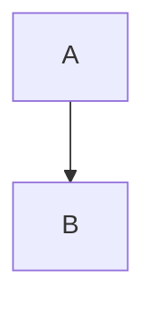

# All features

Intro with **bold**, _italic_, `inline <code>` & an autolink https://example.com.

> [!NOTE]
> Callouts become Confluence panels.

> [!WARNING] 
> Careful with **this**.

> A plain quote stays a quote.

```ts
const x: Array<number> = [1, 2] // ]]> must survive CDATA
```

    indented code block



| Name | Value |
|------|------:|
| a    | 1     |

- [ ] open task
- [x] done task

A normal list:

- normal item
- second item


See [the other page](../other.md#section), [a repo file](../confluence.json) and [an anchor](#all-features).

Raw <script>alert(1)</script> HTML is escaped.

---
